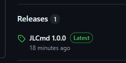
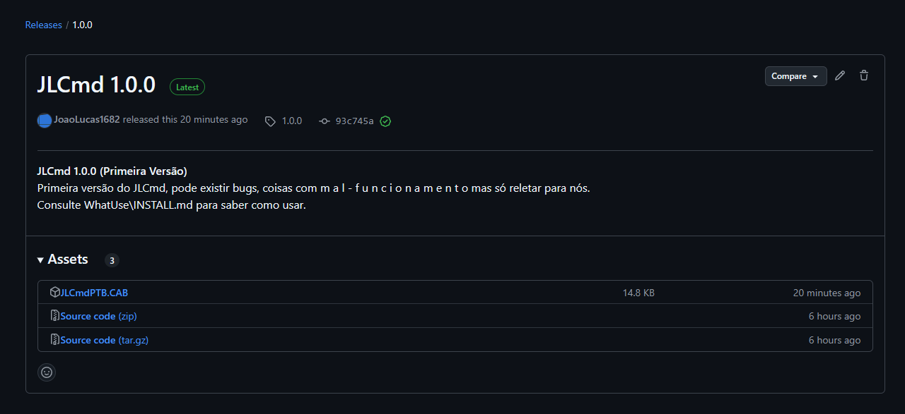
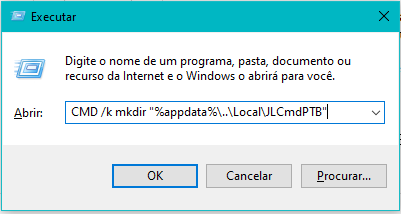
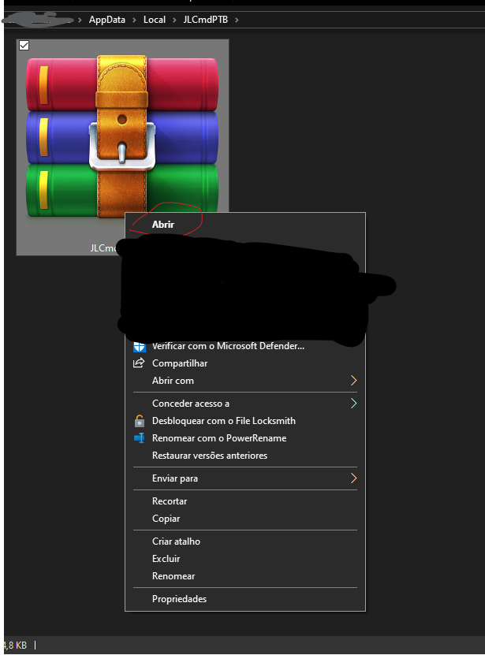
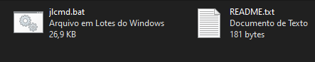
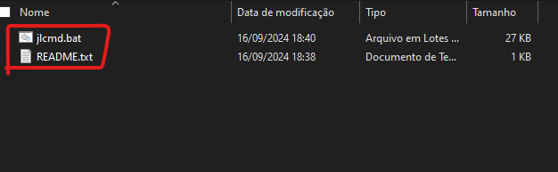

# Como instalar o JLCmd e usa-lo

Veja o passo a passo sobre como instalar o JLCmd ao seu computador, então vamos lá

## Requisitos Minimos
Não pense que você pode usar qualquer PC para rodar o JLCmd, antes verifique se você bate com os requisitos, são simples:
  1. Armazenamento: 32 KB de espaço livre + pelo menos 64 KB em seu Disco onde está instalado o PC para o JLCmd usar o %temp%.
  2. OS: Windows 10 Pro 22H2 Compilação 19045.4894 e superiores.
  3. RAM: pelo menos 5 MB.
  4. Graficos: 2 Cores (Preto e Branco).

## Baixando e Instalando em seu PC
Primeiro, vá até Releases e clique na marca verde escrita Latest:
 

 
Depois de entrar você vai se deparar com esta parte:
 

 
Clique em JLCmdPTB.cab e isso vai baixa-lo o JLCmd compactado no Windows Cabinet File. 

Ao termina-lo de baixa-lo mova em alguma pasta que ninguém mexa para não prejudicar o JLCmd (Para deixar mais fácil, pressione Windows+R e digite: CMD /k mkdir "%appdata%\..\Local\JLCmdPTB" ):
 

 
Pressione [ENTER] e vai aparecer uma janela preta (você pode fecha-la).
 
Mova o arquivo baixado JLCmdPTB.cab para %appdata%\..\Local\JLCmdPTB e abra o arquivo cab, você verá esses arquivos:
 

 
Você jogue os arquivos até a pasta criada (%appdata%\..\Local\JLCmdPTB):
 

 
Você pode ver o README ou já iniciar o JLCmd executando o jlcmd.bat.

